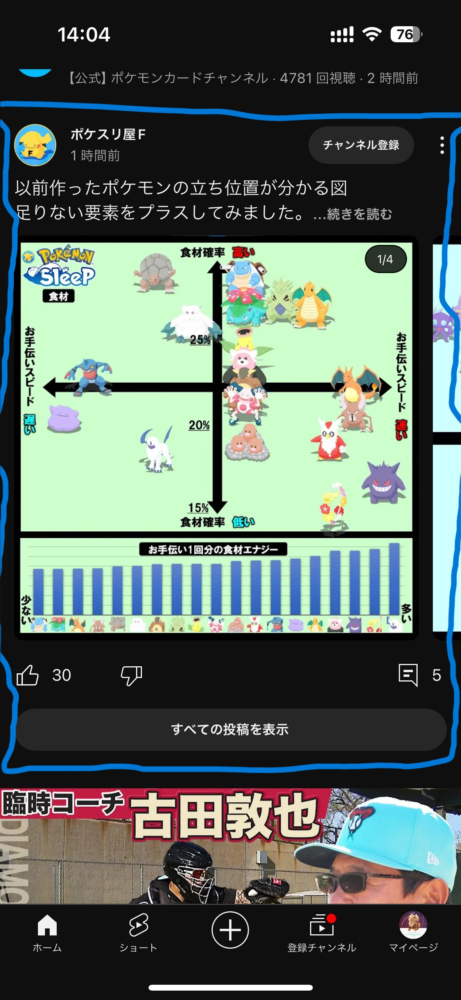

# ヒント1

## 1. 大まかなセクションで区切る

- まずは画面全体を見てみて、いくつかのセクションで区切ります（グループ化します）
- 例として、次のように区切ってみました
  - 動画のセクション
    - 
  - ショートのセクション
    - 
  - 投稿（文章 + サムネイル）のセクション
    - 

## 2. 1で区切ったセクションを1つずつ実装する

- 1で区切ったセクションを1つずつ実装していきます
- 区切ったセクションを構成している要素を洗い出します
  - 
  - 動画のセクションは、次の要素から構成されています
    - サムネイル
    - ミュートアイコン（サムネイルの右上）
    - 字幕アイコン（サムネイルの右上）
    - 再生時間（サムネイルの右下）
    - チャンネルアイコン
    - 動画タイトル
    - チャンネル名
    - 再生回数
    - 投稿日
    - 「:」アイコン
- 洗い出した要素をどのように組み合わせればいいかを考えます
  - 縦の並びと横の並びをどのように組み合わせればいいかを考えます
  - このとき、とりあえず各要素を仮に「色付きのContainer」で組み立ててみましょう
    - 
    - あくまでざっくり雛形を作るのが目的なので、隙間が空いたり大きさが微妙に違っていてもOK
- 仮で作った「色付きのContainer」を1つずつ、本来実装したいパーツに変えていきます
