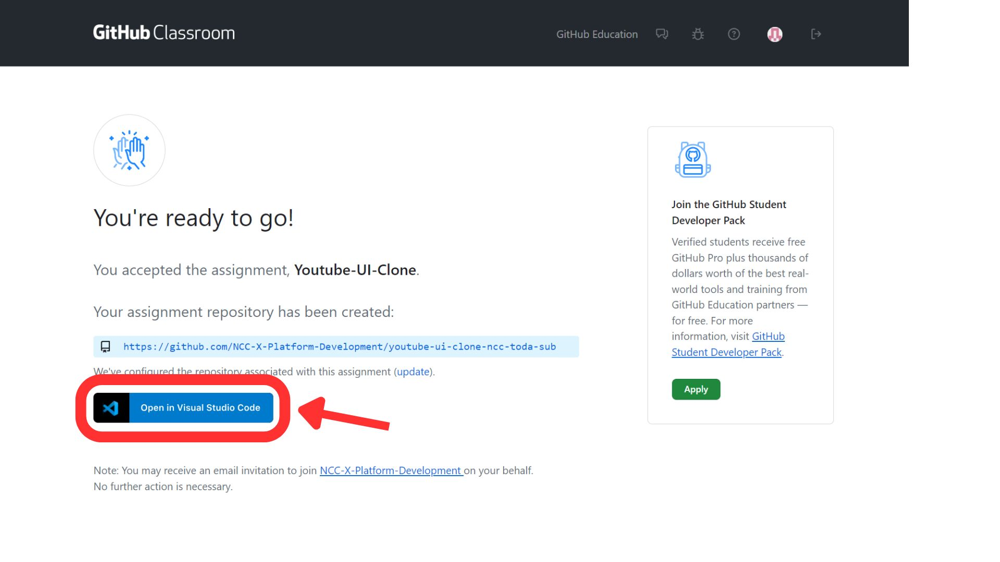
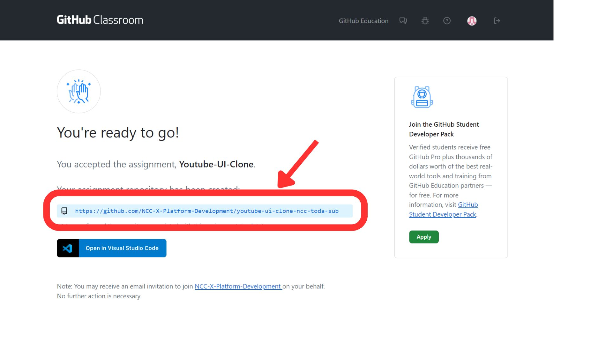
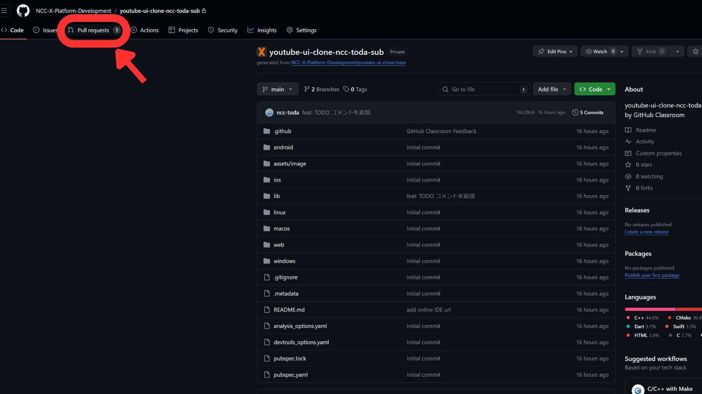
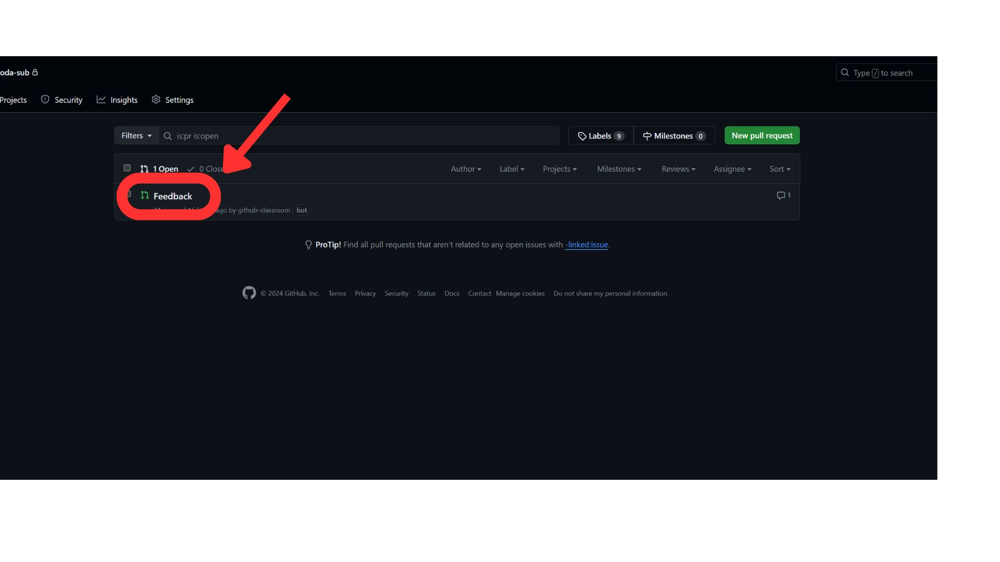

# classroom 操作手順

## やること

1. 招待用のリンクを送るので、そのリンクにアクセスする
2. 自分の名前を選択する
   1. もし他の人を選択してしまった場合は教えて下さい
3. VS Code で開く（ 「Open in Visual Studio Code」をクリックする ）
   1. 
4. VS Code で実装する
5. 適宜 commit する
   1. 慣れている人は自由に commit して大丈夫です
   2. 「 commit? ナニソレオイシイノ 」という方は、授業終わりのタイミングで commit してください
      1. この場合、 commit メッセージは「5/16 授業終了時」などとしてください
6. 最終提出の際は、該当の Pull Request （ PR ）に、デバッグビルドした画面のスクリーンショットを送ってください
   1. 該当の PR には次の手順でたどり着けます
      1. 招待用リンクを開く
      2. <https://github~~> と書かれたリンクを開く
         1. 
      3. GitHub が開くので、「 Pull Request 」タブを開く
         1. 
      4. Feedback をクリックする
         1. 
7. 先生からの指示に従い、必要に応じてコメントを残す

## トラブルシューティング

### VS Code 上からの GitHub のサインインがうまくいかない（延々にロードが続く）

- 対処法1: VS Code の再起動
- 対処法2: 規定のブラウザを Google Chrome にする
