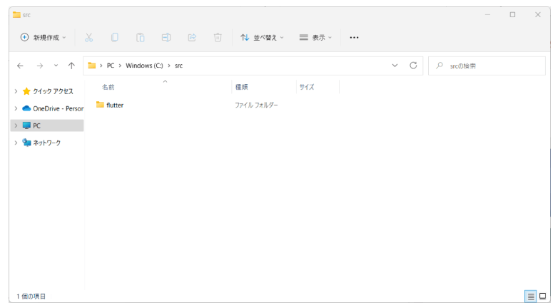
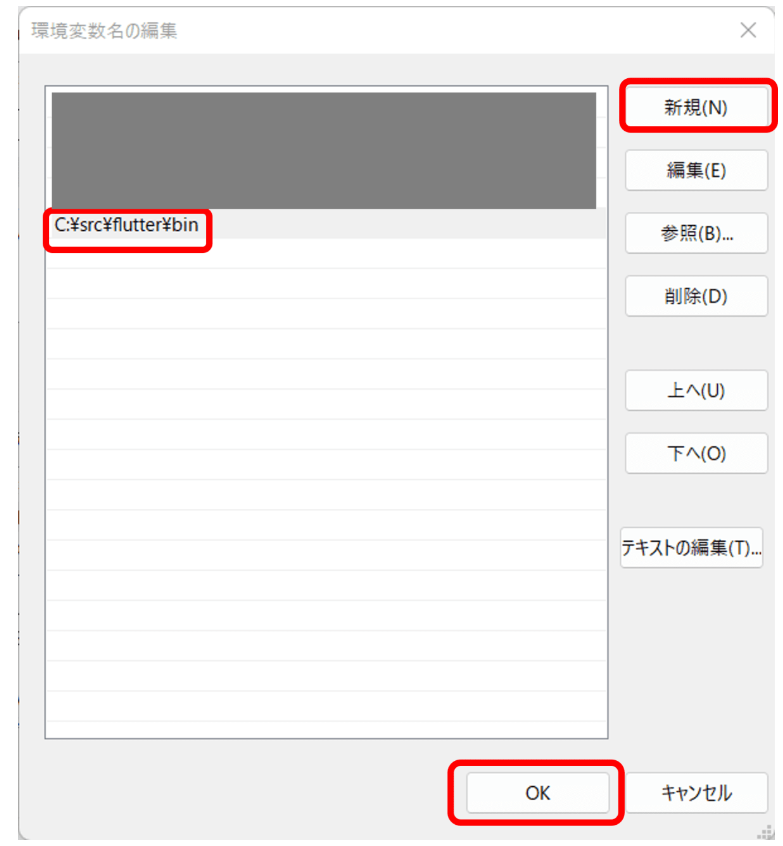
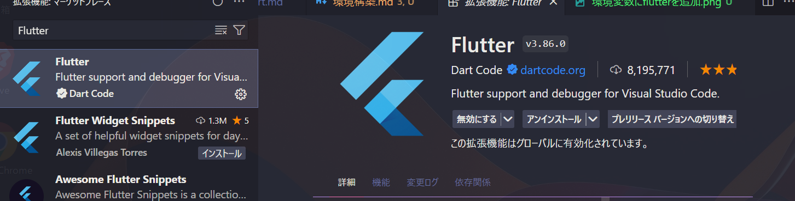
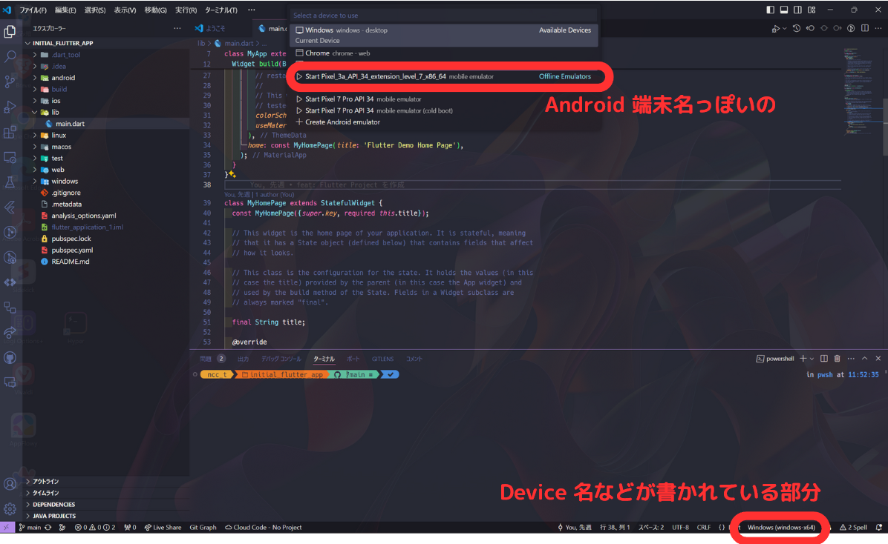

# 環境構築

## 目次

- [環境構築](#環境構築)
  - [目次](#目次)
  - [ゴール](#ゴール)
  - [参考記事](#参考記事)
  - [やること](#やること)
    - [0. 前提](#0-前提)
    - [1. Flutter SDK をダウンロードする](#1-flutter-sdk-をダウンロードする)
    - [2. パスを通す](#2-パスを通す)
    - [3. VS Code で必要な拡張機能をインストールする](#3-vs-code-で必要な拡張機能をインストールする)
    - [4. Flutter プロジェクトを作成する](#4-flutter-プロジェクトを作成する)
    - [5. Emulator でデバッグビルドする](#5-emulator-でデバッグビルドする)
    - [6. Chrome でデバッグビルドする](#6-chrome-でデバッグビルドする)

## ゴール

- VS Code で Android Emulator, Chrome 両方のデバッグビルドができる
- VS Code に指定した拡張機能がインストールされている

## 参考記事

<https://zenn.dev/kazutxt/books/flutter_practice_introduction/viewer/06_chapter1_environment>

## やること

### 0. 前提

以下がダウンロード済みであることが前提です。
まだダウンロードしていない方はダウンロードしてください。

- Android Studio
- VS Code
- Google Chrome

### 1. Flutter SDK をダウンロードする

1. [こちら](https://docs.flutter.dev/get-started/install/windows/mobile?tab=download#install-the-flutter-sdk) の 「flutter_windows3.19.6-stable.zip」をクリックしてダウンロードする
2. ダウンロードした zip ファイルを解凍する
3. 解答すると出てくる「flutter」フォルダを、お好みのフォルダに配置する
   1. 配置先に迷ったら、 Cドライブ直下に「src」フォルダを作成して、その中に配置してください
      1. ただし、「ダウンロード」には格納しないでください
   2. 

※ 1,2 はそこそこ時間かかります。

### 2. パスを通す

1. 用意した「flutter」フォルダ内の「bin」フォルダのパスをコピーする
   1. Cドライブ直下の「src」フォルダ内に配置した場合、「C:\src\flutter\bin」です
2. 「設定」>「システム」>「バージョン情報」>「システムの詳細設定」>「環境変数」>「Path」>「編集」>「新規」で、コピーしたパスを入力し、「OK」をクリックする
   1. 
   2. 困ったら [こちら](https://zenn.dev/kazutxt/books/flutter_practice_introduction/viewer/06_chapter1_environment#2.-fluttersdkのインストール) を参照してください
3. 「コマンドプロンプト」などで、「flutter --version」を実行して、 Flutter のバージョンなどが表示されれば OK
   1. エラーが出たら、「コマンドプロンプト」などを再起動する

### 3. VS Code で必要な拡張機能をインストールする

1. [こちら](https://marketplace.visualstudio.com/items?itemName=Dart-Code.flutter) をクリックして、拡張機能をインストールする
   1. VS Code の拡張機能から検索しても OK
   2. 

### 4. Flutter プロジェクトを作成する

1. VS Code を開く
2. 「Ctrl」+「Shift」+「P」でコマンドパレットを開く
3. 「flutter」と入力し、「Flutter:New Project」を選択する
4. 「Application」を選択する
5. Project を格納するフォルダを選択する
   1. 格納するフォルダに迷ったら、Cドライブ直下に「Flutter_Project」というフォルダを作成し、そこに格納してください
   2. 格納するフォルダやその親のフォルダには「日本語」を含めないでください
6. プロジェクト名を入力する
   1. 迷ったらデフォルトのままで OK （ flutter_application_1 ）
   2. プロジェクト名には「日本語」を含めないでください
7. Flutter Project が作成されるので少し待つ

### 5. Emulator でデバッグビルドする

1. 作成した Flutter Project の lib/main.dart を開く
2. VS Code の右下の「 Device 名などが書かれている部分 」をクリックして、「 Android 端末名っぽいの」をクリックする
   1. 
3. Emulator が立ち上がるのを待つ
4. 「F5」キーを押す
   1. VS Code 左の「実行とデバッグ」タブ >「実行とデバッグ」でも OK
5. Emulator でアプリが起動されたら OK

### 6. Chrome でデバッグビルドする

1. Emulator のデバッグビルドと同じ要領で、デバイスを「 Chrome 」に指定する
2. 「F5」キーを押す
   1. VS Code 左の「実行とデバッグ」タブ >「実行とデバッグ」でも OK
3. Chrome が開きアプリが起動されたら OK
