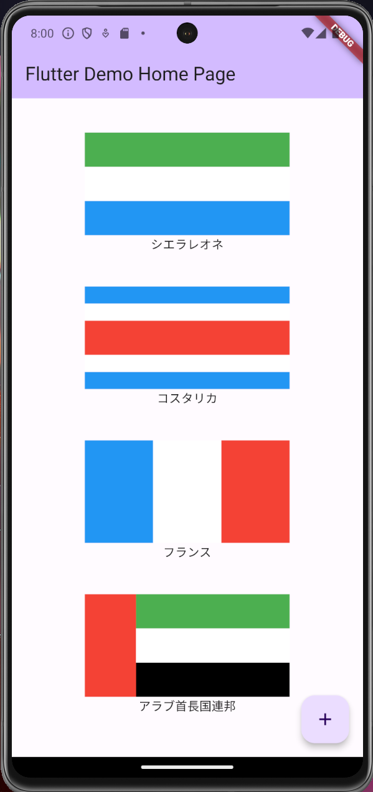
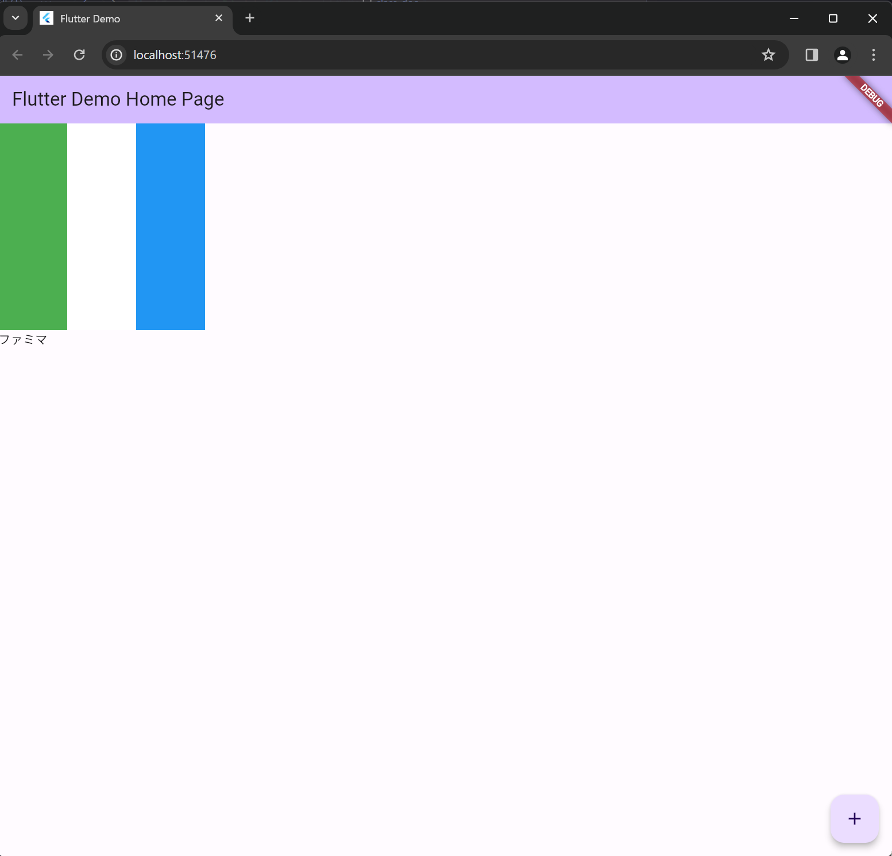
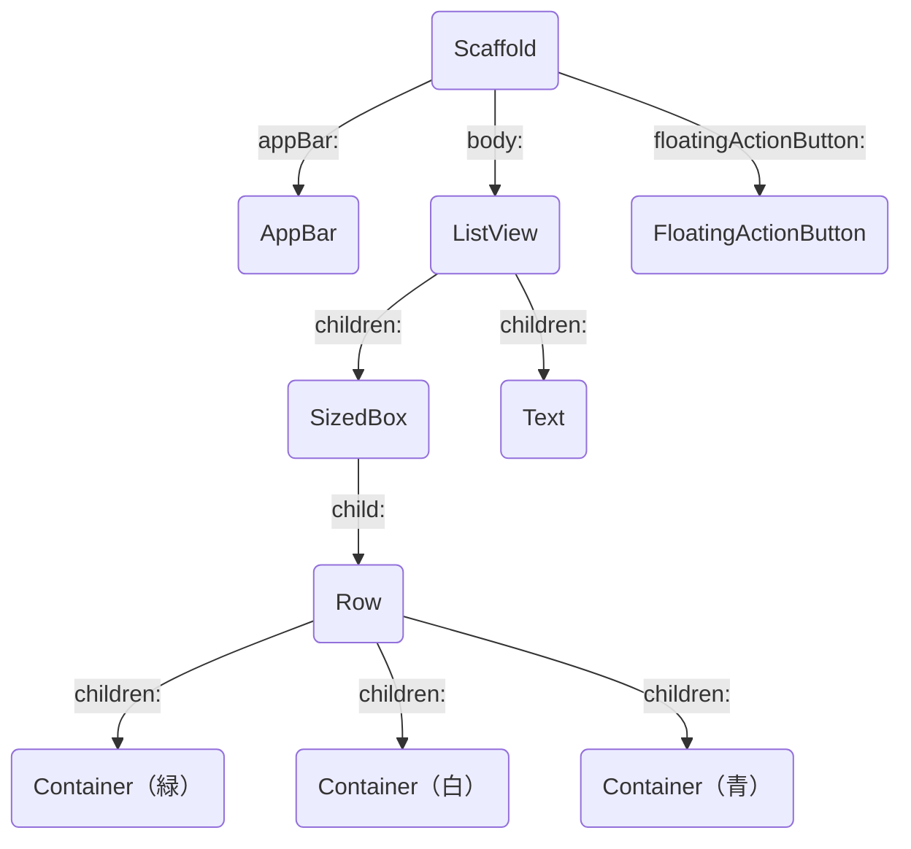

# 第1回授業資料

## 今回の授業の目標

- Widget を組み合わせて UI を作る感覚を身につける
  - Container, SizedBox, Text, Row, Column を使えるようになる
  - ↓ のような UI を作り、スクショを課題から提出する
    - 

## スケジュール変更のお知らせ

[授業の全体像](授業の全体像.md)

## Widget の使い方

### Widget の書き方

- Widget は アッパーキャメルケースで書く
  - 各単語の先頭を大文字にする
  - 例: `Container`, `SizedBox`
- Widget の後に `()` を書く
  - 例: `Container()`, `SizedBox()`
  - プロパティなどは、この `()` の中に書く
    - 例: `Container(width: 100, height: 100)`
    - 各プロパティは `,` で区切る

### child, children について

- Widget には 「 child を持つ Widget 」「 children を持つ Widget 」「 child も children も持たない Widget 」がある
- child を持つ Widget は、1つの Widget を子 Widget として指定できる
  - 例: `SizedBox`, `Container`, `Text`, `Icon`
- children を持つ Widget は、複数の Widget を子 Widget として指定できる
  - 例: `Row`, `Column`, `ListView`
- child も children も持たない Widget は、各プロパティの条件を満たす Widget を指定する
  - 例: `Scaffold`, `AppBar`, `FloatingActionButton`

### VS Code の便利機能

- 既存の Widget の親になる Widget を作る
  - `Ctrl + .` → `Wrap with 〇〇` で、既存の Widget を 別の Widget で囲むことができる

### Widget Tree

#### UI



#### コード

```dart
class MyHomePage extends StatelessWidget {
  const MyHomePage({super.key, required this.title});
  final String title;

  @override
  Widget build(BuildContext context) {
    return Scaffold(
      appBar: AppBar(
        backgroundColor: Theme.of(context).colorScheme.inversePrimary,
        title: Text(title),
      ),
      body: ListView(
        children: [
          SizedBox(
            height: 240,
            width: 240,
            child: Row(
              children: [
                Container(
                  width: 80,
                  color: Colors.green,
                ),
                Container(
                  width: 80,
                  color: Colors.white,
                ),
                Container(
                  width: 80,
                  color: Colors.blue,
                ),
              ],
            ),
          ),
          const Text('ファミマ'),
        ],
      ),
      floatingActionButton: const FloatingActionButton(
        onPressed: null,
        tooltip: 'Increment',
        child: Icon(Icons.add),
      ),
    );
  }
}
```

#### ツリー図



### 前回と今回で使う主な Widget

- `Container`: 指定したサイズの空間を作り、色を指定できる
- `SizedBox`: 指定したサイズの空間を作る
- `Text`: テキストを表示する
- `Row`: 横方向に子 Widget を並べる
- `Column`: 縦方向に子 Widget を並べる（スクロール非対応）
- `ListView`: 縦方向もしくは横方向に子 Widget を並べる（スクロールに対応）

## 覚えておいてほしいこと

- 縦に並べる Widget （ Column ） と横に並べる Widget （ Row ） を組み合わせて UI を作る感覚
