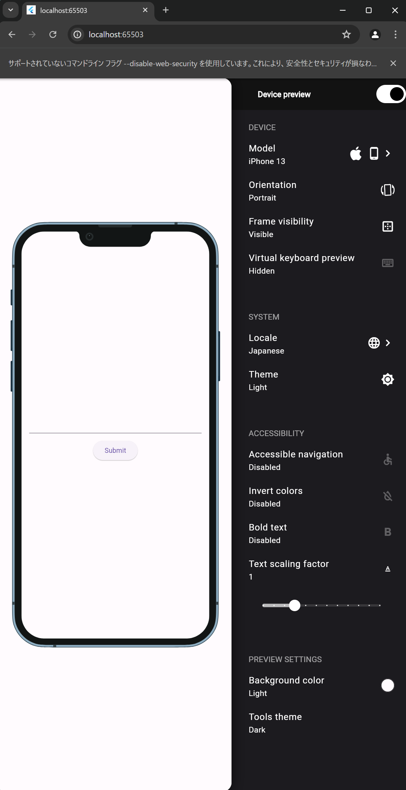

# 授業資料（第12回～最終回まで）

## 最終課題について

### 概要

今回の授業から最終回の授業まで、最終課題に取り組んでもらいます。
最終課題では [こちらの教材](https://zenn.dev/sugitlab/books/flutter_poke_app_handson) を参考に、ポケモン図鑑アプリを作ってもらいます。

### 最終課題の評価

※暫定です。変更あり次第、お知らせします。

#### S

- 上記教材の最後まで実装が完了しており、かつ、追加機能の実装やコーディングの工夫など加点要素が十分にある

#### A

- 上記教材の最後まで実装が完了している
- 上記教材の最後まで実装が完了していないが、追加機能の実装やコーディングの工夫など加点要素が十分にある

#### B,C

- 上記教材の最後まで実装が完了していない
- 実装状況に応じて、B または C とします

#### D

- 未提出
- 提出しているが、何もやっていないに等しい

### 期限

※暫定です。変更あり次第、お知らせします。

2024-07-12 (金) 17:00 まで
※期限後の提出は認めません

### 成績評価

※暫定です。変更あり次第、お知らせします。

#### A

以下のいずれかの条件を満たす場合、A評価とします。
なお、出席数が足りない場合は、以下のいずれかの条件を満たしていてもC未満とします。

- 最終課題を含めた全ての課題がA評価（各課題で定めた目標を達成している）以上
- 最終課題を含めた全ての課題が提出されており、A未満の評価があるが、各課題で加点要素が十分にある

#### C

以下のいずれかの条件を満たす場合、C以上の評価とします。
なお、出席数が足りない場合は、以下のいずれかの条件を満たしていてもC未満とします。

- 最終課題がS評価
- 最終課題を含めた全ての課題が提出されており、すべての課題において最低限の要求を満たしている

### リンク集

- [課題用リポジトリ](https://classroom.github.com/a/f1946nSy)
- [教材](https://zenn.dev/sugitlab/books/flutter_poke_app_handson)

## 教材を進めるうえでの注意点

### 解説部分の文章も読みましょう

コード部分だけ見て、それを IDE に入力するだけでなく、解説部分の文章も読みましょう。

解説部分の文章を読むことで、各コードの意味や、そのコードを書く理由がわかります。
短期的に見たら面倒かもしれませんが、長期的に見ると効率的に進めることができます。

### 教材では、ソースコードの記載が一部省かれています

教材の中で以下のような記載が多々あります。

```dart
/// `return XX();` のケース
return Scaffold(
        body: Center(
          child: Image.network(
              "https://raw.githubusercontent.com/PokeAPI/sprites/master/sprites/pokemon/other/official-artwork/25.png"),
        ),
      );

/// `XX(),` のケース
Container(
  child: const Text('electric'),
  padding: const EdgeInsets.all(8),
  decoration: BoxDecoration(
    color: Colors.yellow,
    borderRadius: BorderRadius.circular(20),
  ),
),
```

このような記載がある場合、以下を参考に記述・更新を行ってください。

```dart
/// `return XX();` のケース
/// `StatelessWidget` もしくは `StatefulWidget` を継承するクラスの中の `build` メソッド内に記述する
import 'package:flutter/material.dart';

class TopPage extends StatelessWidget {
  const TopPage({super.key});

  @override
  Widget build(BuildContext context) {
    /// ここ！
    return Scaffold(
      body: Center(
        child: Image.network(
            "https://raw.githubusercontent.com/PokeAPI/sprites/master/sprites/pokemon/other/official-artwork/25.png"),
      ),
    );
  }
}

/// `XX(),` のケース
/// `Container` の `child` や `Column` の `children` など、
/// 該当の `Widget` を適切なプロパティに記述する
import 'package:flutter/material.dart';

class TopPage extends StatelessWidget {
  const TopPage({super.key});

  @override
  Widget build(BuildContext context) {
    return Scaffold(
      body: Center(
        /// ここ！
        child: Container(
          padding: const EdgeInsets.all(8),
          decoration: BoxDecoration(
            color: Colors.yellow,
            borderRadius: BorderRadius.circular(20),
          ),
          child: const Text('electric'),
        ),
      ),
    );
  }
}
```

## その他

### VS Code の拡張で Spell Checker を入れましょう

[こちら](https://marketplace.visualstudio.com/items?itemName=streetsidesoftware.code-spell-checker) から、 Code Spell Checker という拡張をインストールすることができます。

この拡張を入れることで、変数名やクラス名などのスペルミスを検知してくれます。

### VS Code でのダブルクリックのすゝめ

VS Code 上でダブルクリックをすることで、ダブルクリックした文字が含まれる単語全体を選択することができます。
Class名や変数名を選択する際などに便利なので試してみてください。

### device_preview

いままでの課題では、 Chrome で実行した場合でもスマートフォンで実行したような見え方になっていました。
↓ こんな感じです。



こちら、 device_preview というパッケージを使うことで実現できます。
興味のある方は、[こちら](https://pub.dev/packages/device_preview) などを参考に導入してみてください。

導入した方は多少加点します。

