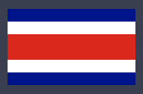
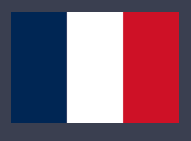
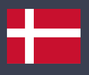
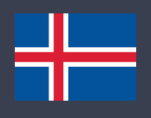
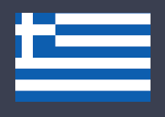

# 第2回授業資料

## 今回の授業の目標

- 環境構築を完了する
- Widget を組み合わせて UI を作る感覚を身につける
  - Container, SizedBox, Text, Row, Column を使えるようになる
  - ↓ のような UI を作る
    - 

## Widget とは

- Flutter の肝
- UI を構成する各要素を Widget と呼ぶ
- Flutter では、 Widget というものをブロックのように組み合わせて UI を作る
- Widget には様々なプロパティが用意されている
  - このプロパティに値を指定して、色や大きさなどを表現する

## 今回の授業で使う Widget

- Container
- SizedBox
- Text
- Row
- Column
- ( ListView )

## UI 実装実習

### 今回の実習のすすめ方

- まずは、「シエラレオネ」と「フランス」を解説しながら実装（みんなで一緒に）
- 以降は各々で実装（相談自由）

### 今回の授業で作る UI

- 「国旗 + テキスト」を縦に配置したもの
- 以下の国旗を実装すること
  - ~~ファミマ~~ シエラレオネ
    - 
  - コスタリカ
    - 
  - フランス
    - 
  - アラブ首長国連邦
    - 

### ポイント

- 国旗は画像ではなく、「 Widget を用いた色付け」で表現してください
- 最初は「きれいなコード」にこだわらなくて OK
  - サイズ指定にハードコーディングを使うなど、ゴリ押しで OK
  - こだわりたい人はどうぞ
- 縦横比や色などはざっくりで OK
  - こだわりたい人はどうぞ

### 余裕のある方向け

余裕のある方は ↓ にチャレンジしてみてください。
お好きなのから取り組んでもらって大丈夫です！

- 「きれいなコード」にリファクタリングしてみてください
- 以下の国旗にもチャレンジしてみてください
  - デンマーク
    - 
  - アイスランド
    - 
  - ギリシャ
    - 

## 覚えておいてほしいこと
